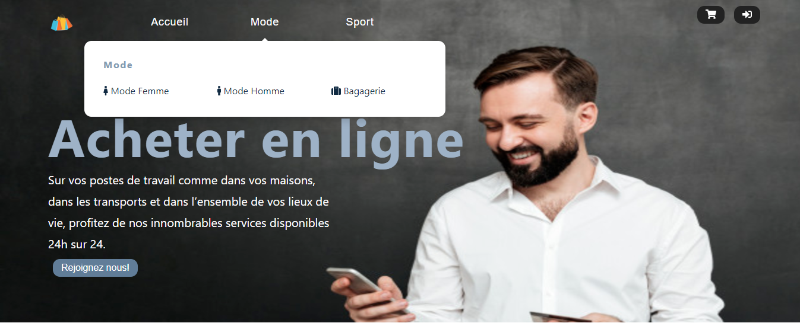
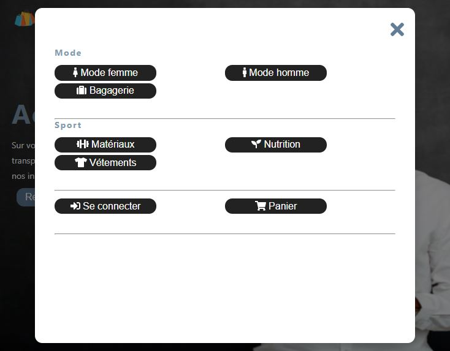

# Submenus
> La réalisation d'une page d'accueil avec les submenus est une continuation de pratique sur la technologie ES6 pour améliorer mes compétences et travailler sur plus de parties de cet langage.

## Table des matiéres
* [Demo](#demo)
* [Technologies](#technologies)
* [Setup](#setup)
* [Statut](#statut)
* [Inspiration](#inspiration)
* [Contact](#contact)
* [Licence](#Licence)

## Demo
Cliquez sur ce lien [PageAccueil]( https://manelkhayat.github.io/PageAccueil-Submenus_ES6/) pour voir une démonstration de mon travail.

## Technologies
* HTML5 
* CSS3
* ES6 (Style de codage : Vanilla JavaScript)

## Setup
Il faut installer Live server sur VS code pour lancer un serveur local de développement avec une fonction de rechargement en direct pour les pages statiques et dynamiques

## Statut
Projet fini.

## Inspiration
Projet inspiré de site [Stripe](https://stripe.com/fr-us)

## Contact
Crée par [@Manel Khayat](https://www.linkedin.cn/in/manel-khayat-413b91184/) - N'hésitez pas à me contacter !

## Licence
MIT
